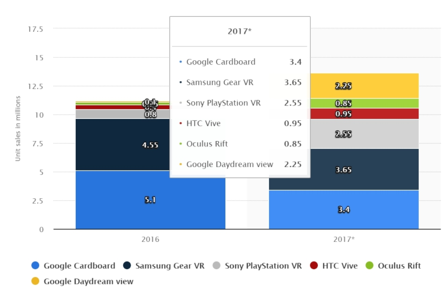
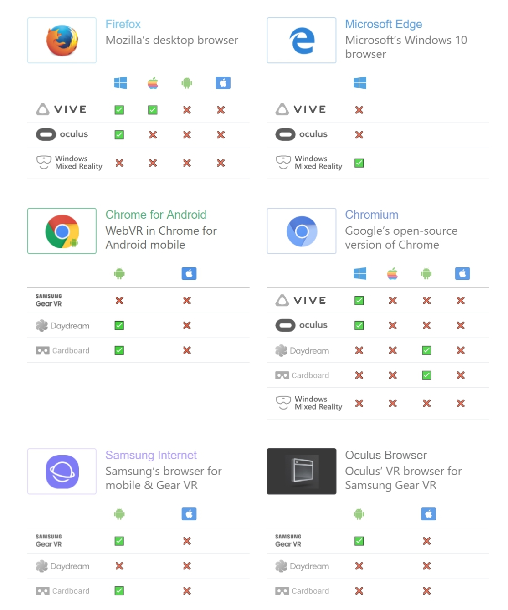

```
ID: 14
Problem: 
Title: Are the VR-developers able to use DCLibb? Yes, on WebVR platform
Author: Noxon
Layer: Game
Dependencies: No need to change other parts
Status: Prototyping
Created: 02.03.2018
```

## Introduction

We have set a task to build something in VR and check our protocol compatibility with following VR libraries. So we have decided to create a game, which will demonstrate compatibility of DAO.Casino logic with VR.

## Motivation and task description
There are a lot of VR platforms, each has own SDK. Moreover, our library is adopted for web and works with browsers.



## Решение
Cardboard is being used by those, who operates with their smartphones. And there are a lot of gambling games in it. On the other hand, Playstation store has none. The most popular VR-helm Samsung Gear also works with smartphones, with a market leader Google.So the most obvious solution for development is to use WebVR, which is a JavaScript framework.

* absolutely open source
* friendly for WEB developers
* JS based

Supported devices is on picture below:



<a href="0014/codeexample.md">Code example</a>
